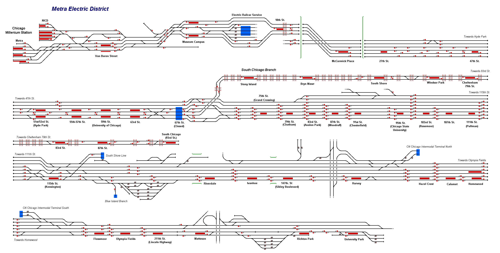

# Chicago Metra Electric District

This map provides a representation of the Metra Electric District network run by the Metra commuter rail system. The lines are for the most part electrified and consist of three routes:

* Main Line: Millenium Station to University Park
* Blue Island Branch: Millenium Station to Blue Island
* South Chicago Branch: Millenium Station to South Chicago

This is version 2 which now includes both the Main Line and the South Chicago Branch.

## Current Status (Stage One: Millenium Station to South Chicago/93rd St.)

| Stage         | Status        |
| ------------- |:-------------:|
| Track Plan     | :heavy_check_mark: |
| Signalling      | :heavy_check_mark:      |
| Naming | :heavy_check_mark:      |
| Speed Limits | :x: |
| Distances | :x: |
| Timetable | :x: |
| Documentation | :x: |

## Data Sources

- [Metra Commuter Rail YouTube Channel](https://www.youtube.com/channel/UCkVENT4jX8WtozQUiV4vVWA).
- [Metra Electric District - Downtown to 93rd/South Chicago - 9/2/18](https://www.youtube.com/watch?v=VZAoIFEEVbY&t=1400s) Youtube video by Isaac Veldman.
- [Metra Railfan Tips - ChicagoRailfan.com](https://www.chicagorailfan.com/tipmetra.html)

Status icons by Freepik, pixelmeetup, Pixel Perfect on FlatIcon.com *do not remove this line*.
